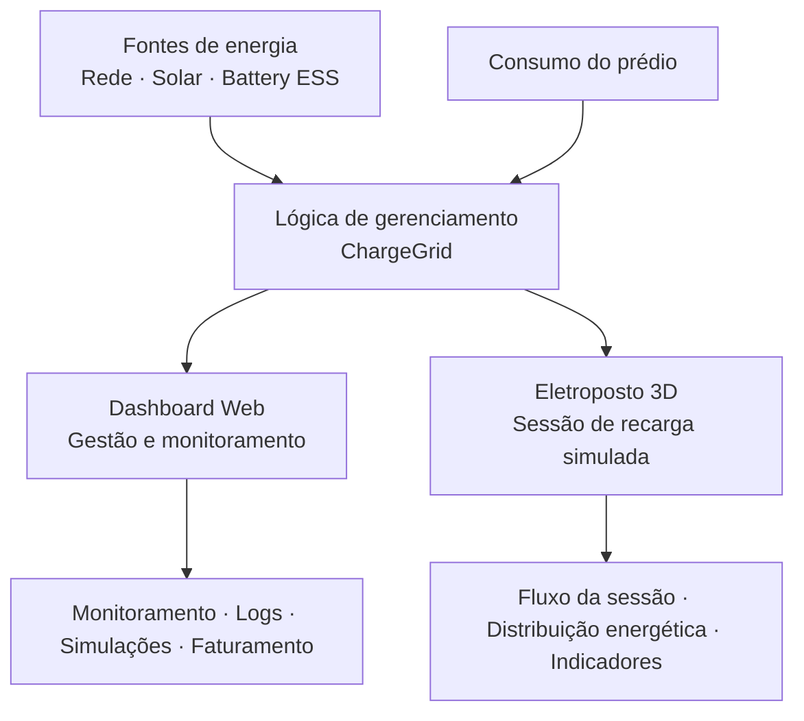
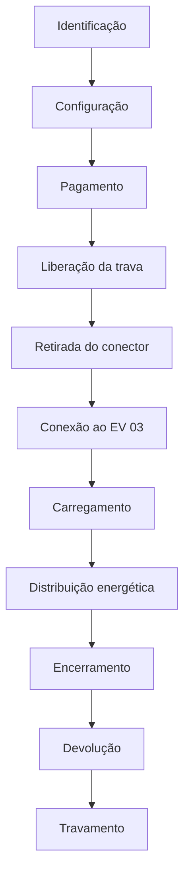
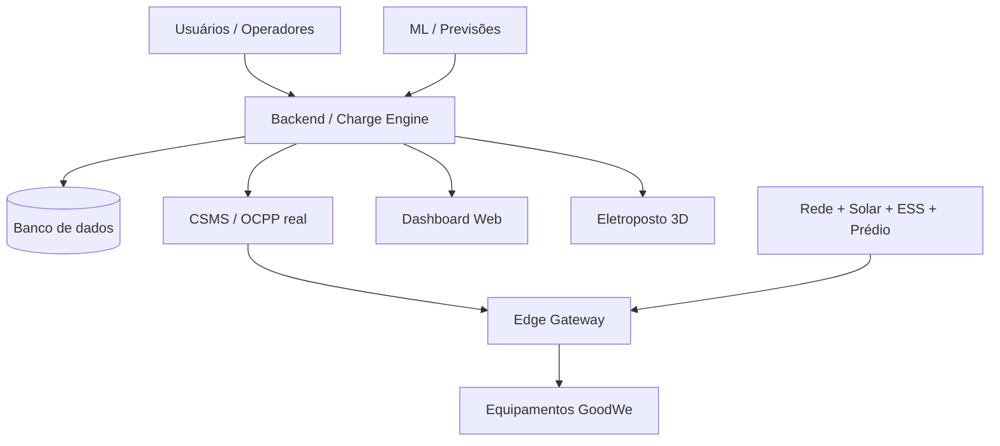

# Arquitetura — GoodWe ChargeGrid Intelligence

**GoodWe Challenge 2026 — FIAP | Sprint 3 | Equipe 7**

---

## 1. Objetivo

Este documento descreve a arquitetura conceitual adotada na Sprint 3 do GoodWe ChargeGrid Intelligence, abrangendo os dois artefatos entregues — **Dashboard Web** e **Eletroposto 3D** — bem como as lógicas de gerenciamento energético simuladas e a visão de arquitetura futura planejada.

O ChargeGrid Intelligence propõe uma solução para coordenar a recarga de veículos elétricos em ambientes comerciais, equilibrando demanda, geração solar, armazenamento (Battery ESS) e consumo do prédio, com o objetivo de evitar picos de demanda e otimizar o uso de energia.

---

## 2. Arquitetura conceitual da Sprint 3

A arquitetura implementada na Sprint 3 é uma **arquitetura de protótipo/demonstração**, composta exclusivamente pelas duas interfaces do produto:



As duas interfaces são **complementares** e representam o mesmo conceito de produto, com **cenários de simulação independentes**.

---

## 3. Componentes do cenário energético

### Fontes de energia

| Componente | Papel no cenário |
|---|---|
| Rede elétrica | Fonte principal de alimentação |
| Geração solar | Fonte renovável complementar (simulada) |
| Battery ESS | Armazenamento de energia — buffer de demanda (simulado) |

### Cargas

| Componente | Papel no cenário |
|---|---|
| Consumo base do prédio | Carga fixa do empreendimento |
| EV 01 | Veículo elétrico com demanda própria |
| EV 02 | Veículo elétrico com demanda própria |
| EV 03 | Veículo principal da sessão demonstrada |

### Lógica de coordenação

| Função | Descrição |
|---|---|
| Load Balancing | Distribuição da potência disponível entre os EVs |
| Peak Shaving | Redução temporária da potência em picos de demanda |
| Distribuição energética | Cálculo da potência alocável considerando todas as fontes e cargas |

---

## 4. Lógica de gerenciamento

### Potência disponível

A potência disponível para os carregadores é calculada de forma simplificada:

```
Potência disponível = Limite da rede + Geração solar + ESS disponível − Consumo do prédio
```

A lógica distribui essa potência disponível entre os EVs conectados, respeitando os limites individuais de cada veículo e as regras de balanceamento.

### Regras de prioridade (simuladas)

1. O consumo base do prédio é sempre atendido primeiro.
2. A geração solar reduz a demanda da rede.
3. O Battery ESS pode complementar a potência disponível ou absorver excedentes.
4. A potência restante é distribuída entre os EVs pelo Load Balancing.
5. Se a demanda total superar o limite da rede, o Peak Shaving reduz temporariamente a potência dos carregadores.

> ⚠️ Toda essa lógica é **simulada** nos dois protótipos. Não existe um motor de cálculo em produção, nem integração com sensores ou equipamentos físicos.

---

## 5. Dashboard Web

🔗 [https://goodwe-grid-smart.lovable.app/](https://goodwe-grid-smart.lovable.app/)

### Stack

| Camada | Tecnologias |
|---|---|
| Framework / Linguagem | React 18, TypeScript, Vite |
| UI | Tailwind CSS, shadcn/ui, Radix UI, Lucide React |
| Roteamento | React Router |
| Gráficos | Recharts |
| Mapas | Leaflet, OpenStreetMap |
| Dados assíncronos | TanStack React Query |
| Testes | Vitest |

### Camada de dados — LiveDataProvider

O Dashboard não possui backend de produção. Os dados são gerados e gerenciados localmente pela camada **LiveDataProvider**, que mantém o estado de:

- `chargers` — carregadores cadastrados;
- `logs` — eventos operacionais;
- `load` — carga da rede;
- `activeSessions` — sessões em andamento;
- `completedSessions` — sessões encerradas;
- `totals` — totalizadores.

Os dados são **atualizados aproximadamente a cada 2 segundos**, simulando atualização em tempo real.

### Funções principais

| Função | Descrição |
|---|---|
| `startSession` | Inicia uma sessão de recarga simulada |
| `endSession` | Encerra uma sessão de recarga simulada |
| `applyPeakShaving` | Aplica a lógica de Peak Shaving no cenário |

### Parâmetros do cenário do Dashboard

> ⚠️ Valores **exclusivos do Dashboard** — diferentes dos parâmetros do Eletroposto 3D.

| Parâmetro | Valor |
|---|---|
| Limite da rede | 200 kW |
| Consumo base | 120 kW |
| Carregadores | até 22 kW cada |

### Áreas funcionais

| Área | Descrição |
|---|---|
| Painel Geral | Visão consolidada da operação |
| Balanceamento | Distribuição de potência entre estações |
| Estações | Status dos carregadores e sessões |
| Logs OCPP | Eventos operacionais (nomenclatura OCPP, gerados localmente) |
| IA & Previsão | Demonstrativa — sem modelo ML treinado |
| Simulador "E Se..." | Simulação de cenários alternativos |
| Faturamento | Relatórios financeiros simulados |
| Usuários & Frotas | Protótipo de gestão |

---

## 6. Eletroposto 3D

### Stack

| Camada | Tecnologias |
|---|---|
| Linguagens | HTML, CSS, JavaScript |
| 3D | Three.js, GLTFLoader, PointerLockControls |
| Modelo | GLB (ChargeGrid_Web.glb) |

### Arquivos

| Arquivo | Papel |
|---|---|
| `index_V8_1_SPRINT3.html` | Interface 3D principal |
| `ChargeGrid_Web.glb` | Modelo 3D do eletroposto |

### O que o Eletroposto 3D demonstra

- Geração solar e contribuição renovável
- Rede elétrica e limite de demanda
- Battery ESS (armazenamento de energia)
- Consumo base do prédio
- Três veículos (EV 01, EV 02, EV 03) com demandas distintas
- Distribuição automática de energia
- Indicadores em tempo real: tempo, energia entregue, custo, percentual renovável

---

## 7. Fluxo da sessão de recarga

O Eletroposto 3D demonstra o seguinte fluxo:



> ⚠️ Fluxo **completamente simulado**. Não existe hardware físico, OCPP real ou pagamento real.

---

## 8. Modelo energético do protótipo 3D

### Distribuição de potência

```
Potência disponível para carga = Limite da rede + Solar + ESS − Consumo do prédio

Potência disponível = 35 kW + Solar + ESS − 32 kW
                    = margem inicial ≈ 3 kW + contribuição solar/ESS
```

A margem inicial pequena (≈ 3 kW apenas da rede) foi intencionalmente definida para exigir a atuação da geração solar e do Battery ESS para que os EVs possam ser carregados de forma significativa.

### Distribuição entre os EVs

```
Potência disponível total
          ↓
   Load Balancing
          ↓
  ┌───────┼───────┐
  ↓       ↓       ↓
EV 01   EV 02   EV 03
(≤18kW) (≤12kW) (≤20 ou ≤28kW)
```

---

## 9. Parâmetros da simulação 3D

> ⚠️ Valores **exclusivos do Eletroposto 3D** — diferentes dos parâmetros do Dashboard Web.

| Parâmetro | Valor | Justificativa |
|---|---|---|
| Limite da rede | **35 kW** | Restrição de demanda para demonstrar a necessidade de gerenciamento |
| Consumo base do prédio | **32 kW** | Deixa margem inicial pequena para os EVs |
| Battery ESS | **60 kWh** | Capacidade de armazenamento que complementa a demanda |
| SOC inicial | **72%** | Estado de carga inicial representativo |
| EV 01 | até **18 kW** | Demanda intermediária |
| EV 02 | até **12 kW** | Demanda menor |
| EV 03 — Economy | até **20 kW** | Modo econômico |
| EV 03 — Fast | até **28 kW** | Modo rápido — maior demanda do cenário |
| Velocidade de simulação | **60×** | Compressão do tempo para fins de demonstração |

### Justificativa dos parâmetros

Os valores foram escolhidos para representar um **cenário comercial com restrição de demanda**. O limite da rede de 35 kW e o consumo base de 32 kW deixam uma margem inicial pequena, criando a necessidade de geração solar e Battery ESS para que os EVs possam ser carregados de forma significativa. As potências distintas dos EVs permitem demonstrar diferentes níveis de demanda e observar a atuação das regras de gerenciamento.

> ⚠️ Esses valores são **exclusivamente simulados** e **não representam** dimensionamento elétrico real, homologação, especificação de instalação, recomendação para instalação comercial ou validação de engenharia.

---

## 10. Load Balancing

O Load Balancing representa a **distribuição da potência disponível entre os veículos** de acordo com as condições do cenário.

### Fluxo da lógica

```
Demanda dos EVs
       ↓
Verificação da capacidade disponível
       ↓
Potência disponível
       ↓
Distribuição entre veículos
       ↓
Carga controlada
```

### Critérios de distribuição (simulados)

- A potência total disponível é calculada a partir das fontes menos o consumo do prédio.
- Cada EV recebe uma fração proporcional ou conforme regra de prioridade definida na simulação.
- Se a demanda combinada superar a disponibilidade, cada EV tem sua potência reduzida proporcionalmente.

> **Status: SIMULADO** — sem integração com controladores físicos ou CSMS real.

---

## 11. Peak Shaving

O Peak Shaving representa a **redução temporária da potência destinada aos carregadores** quando a demanda simulada atinge ou supera o limite da rede.

### Fluxo da lógica

```
Demanda elevada
       ↓
Detecção do pico
       ↓
Peak Shaving ativado
       ↓
Redução temporária da potência dos carregadores
       ↓
Demanda reduzida abaixo do limite
```

> **Status: SIMULADO** — sem integração com equipamentos de medição real ou sistemas de controle físico.

---

## 12. Relação entre as duas interfaces

| Aspecto | Dashboard Web | Eletroposto 3D |
|---|---|---|
| Função principal | Gestão e monitoramento | Operação simulada da sessão |
| Cenário energético | 200 kW / 120 kW / 22 kW | 35 kW / 32 kW / 60 kWh |
| Stack principal | React + TypeScript | HTML + Three.js |
| Dados | LiveDataProvider (local) | Simulação interna (JS) |
| OCPP | Eventos locais inspirados em OCPP | Não aplicável |
| Acesso | Link público (Lovable) | Servidor HTTP local |

As duas interfaces são **partes do mesmo produto** e demonstram aspectos complementares do conceito ChargeGrid. **Os cenários de simulação são independentes e não devem ser confundidos.**

---

## 13. Conexão com os conteúdos da disciplina

| # | Conteúdo | Aplicação no ChargeGrid |
|---|---|---|
| 1 | Lógica e tomada de decisão | Regras de distribuição de potência e controle de demanda |
| 2 | Automação / IoT | Conceito de coleta de dados e atuação automática sobre cargas |
| 3 | Gestão de estações e sessões | Monitoramento de carregadores, veículos e sessões ativas |
| 4 | Logs operacionais (OCPP) | Eventos simulados com nomenclatura inspirada no protocolo OCPP |
| 5 | Load Balancing | Distribuição da potência disponível entre múltiplos EVs |
| 6 | Peak Shaving | Redução da demanda em períodos de pico |
| 7 | Geração solar | Fonte renovável integrada ao cenário energético |
| 8 | Battery ESS | Armazenamento energético como buffer de demanda |
| 9 | Sustentabilidade | Melhor aproveitamento das fontes e infraestrutura disponível |
| 10 | Eficiência energética | Coordenação entre consumo, geração, armazenamento e recarga |

---

## 14. Uso de simulações

O Dashboard Web e o Eletroposto 3D permitem testar estratégias de automação e gerenciamento energético em um **ambiente controlado, sem risco físico**.

A simulação permite demonstrar:

- sessões de recarga e seu fluxo completo;
- distribuição de potência entre fontes e cargas;
- Load Balancing entre múltiplos EVs;
- Peak Shaving em cenários de alta demanda;
- contribuição da geração solar e Battery ESS;
- indicadores operacionais: energia entregue, tempo, custo e percentual renovável.

O protótipo funciona como uma **validação de conceito** antes de uma eventual implementação física, permitindo ajustar parâmetros e estratégias sem custos de instalação ou riscos elétricos.

---

## 15. Arquitetura futura — PLANEJADA

> ⚠️ Esta seção descreve **componentes ainda não implementados**. Trata-se de uma visão de evolução futura e **não representa a Sprint 3 atual**.

### Visão de arquitetura completa



### Componentes planejados

| Componente | Descrição |
|---|---|
| Backend / Charge Engine | Motor de gerenciamento e regras de negócio |
| Banco de dados | Persistência de sessões, usuários, logs e telemetria |
| CSMS / OCPP real | Central de gerenciamento com protocolo OCPP efetivo |
| Edge Gateway | Dispositivo de borda (ex: Raspberry Pi) para comunicação com os carregadores |
| Integração física GoodWe | Conexão com carregadores e inversores GoodWe reais |
| ML / Previsões | Modelo de Machine Learning para previsão de demanda |
| Pagamentos reais | Integração com meios de pagamento (PIX, cartão) |
| Autenticação e segurança | Gestão de identidade e controle de acesso |
| Telemetria real | Coleta de dados em tempo real dos equipamentos |

### Evolução futura

Essa arquitetura poderá ser desenvolvida em:

- **futuras Sprints** do Challenge;
- uma **prova de conceito física** com equipamentos reais;
- a **continuidade do próprio Challenge GoodWe**.

---

## 16. Segurança futura

> Esta seção lista requisitos de segurança para uma **implementação real futura**. Nenhum desses itens está implementado no protótipo atual.

Para uma implementação de produção, seriam necessários:

- **Autenticação e autorização** — gestão de identidade para usuários e operadores;
- **TLS** — criptografia de todas as comunicações;
- **Autenticação de dispositivos** — validação dos carregadores e gateways na rede;
- **Gestão de credenciais** — armazenamento seguro de chaves e segredos;
- **Validação de mensagens OCPP** — prevenção de mensagens malformadas ou injetadas;
- **Isolamento da rede dos carregadores** — segmentação de rede para os dispositivos de campo;
- **Logs de auditoria** — rastreabilidade de eventos operacionais e de segurança;
- **Proteção de APIs** — rate limiting, autenticação e monitoramento;
- **Armazenamento seguro de dados de pagamento** — conformidade com PCI DSS;
- **Monitoramento de segurança** — detecção de anomalias e alertas.

---

## 17. Limitações

- O Dashboard utiliza **dados locais simulados** — não existe backend, banco de dados ou integração real.
- O Eletroposto 3D utiliza **simulação interna em JavaScript** — não existe hardware físico.
- Os logs são **inspirados em OCPP**, mas **não representam comunicação OCPP real**.
- A área de IA/Previsão é **demonstrativa** — não existe modelo de Machine Learning treinado ou validado.
- O faturamento é **simulado** — não existe processamento financeiro real.
- **Não existe Edge Gateway físico** ou integração com Raspberry Pi.
- **Não existe integração física com equipamentos GoodWe**.
- Todos os indicadores numéricos (potência, energia, custo, ROI) são **exclusivamente demonstrativos**.
- Os parâmetros do Dashboard e do Eletroposto 3D são **cenários independentes** e não devem ser comparados diretamente.
