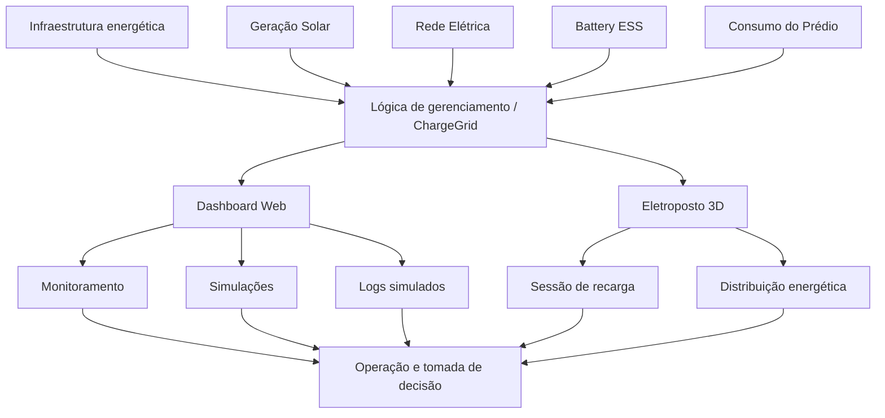
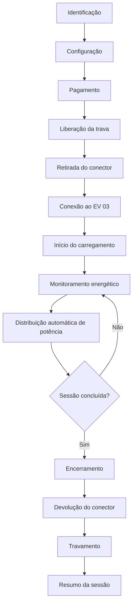
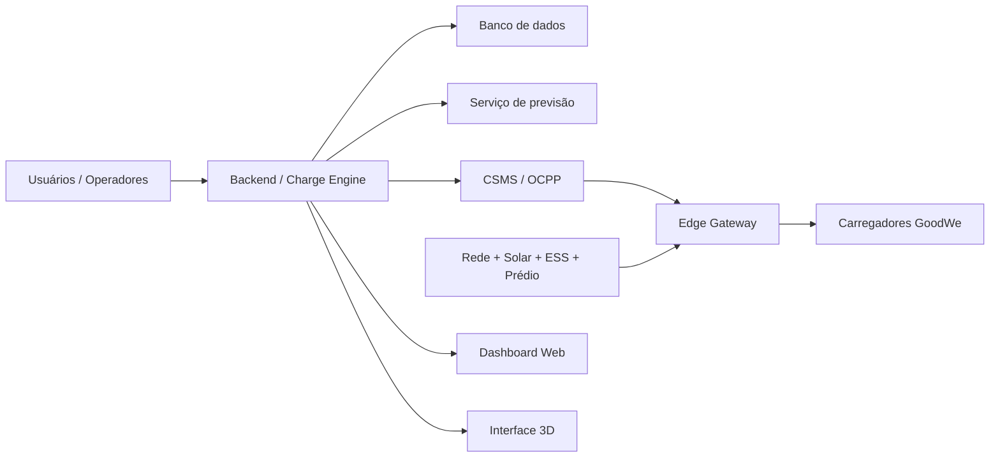

# Arquitetura — GoodWe ChargeGrid Intelligence

## 1. Visão geral

O GoodWe ChargeGrid Intelligence é estruturado como uma solução de gerenciamento inteligente de recarga para ambientes comerciais.

Na Sprint 3, a solução é demonstrada por duas interfaces complementares:

1. **Dashboard Web** — gestão e monitoramento;
2. **Eletroposto 3D** — demonstração da operação física/simulada e da sessão de recarga.

Elas fazem parte do mesmo produto, mas possuem responsabilidades diferentes.

---

## 2. Arquitetura conceitual



O diagrama representa a arquitetura funcional/conceitual da Sprint. Na implementação atual, parte da lógica é executada localmente e utiliza dados simulados.

---

## 3. Componentes

### 3.1 Fontes e cargas

O modelo considera:

- rede elétrica;
- geração solar;
- Battery ESS;
- consumo do prédio;
- EV 01;
- EV 02;
- EV 03.

Esses elementos compõem o cenário energético utilizado para demonstrar o gerenciamento da potência.

### 3.2 Lógica de gerenciamento

A lógica do ChargeGrid tem como objetivo coordenar a energia disponível e as demandas dos veículos.

As decisões demonstradas no protótipo incluem:

- distribuição de potência;
- priorização de carregamentos;
- Load Balancing;
- Peak Shaving;
- consideração de geração solar;
- consideração de Battery ESS.

Na Sprint 3, essas funções são demonstradas por meio de simulações.

---

# 4. Dashboard Web

O Dashboard representa a camada de gestão e monitoramento.

## 4.1 Fluxo funcional

```text
Dados simulados
      ↓
LiveDataProvider
      ↓
Estado da aplicação
      ↓
Componentes do Dashboard
      ↓
Métricas / gráficos / estações / logs / simulações
```

O `LiveDataProvider` mantém dados locais de carregadores, sessões, logs, carga, potência distribuída, energia, receita e estado do Peak Shaving.

A atualização dinâmica ocorre aproximadamente a cada 2 segundos.

## 4.2 Funcionalidades

O Dashboard possui interfaces para:

- Painel Geral;
- Balanceamento;
- Estações;
- Logs OCPP;
- IA & Previsão;
- Simulador "E Se...";
- Faturamento;
- Usuários & Frotas.

### Logs

Os eventos exibidos utilizam nomenclatura inspirada em OCPP:

- `BootNotification`;
- `Heartbeat`;
- `StartTransaction`;
- `StopTransaction`;
- `StatusNotification`;
- `MeterValues`;
- `Authorize`;
- eventos de Load Balancing.

Eles são gerados pelo protótipo e não representam comunicação OCPP real.

### IA e previsão

A interface apresenta uma demonstração de previsão e insights. Os resultados são baseados em dados e cálculos simulados localmente.

Não existe, nesta Sprint, um modelo de Machine Learning treinado e validado conectado ao Dashboard.

---

# 5. Eletroposto 3D

O Eletroposto 3D representa a operação física/simulada do eletroposto.

Arquivos:

```text
index_V8_1_SPRINT3.html
ChargeGrid_Web.glb
```

O HTML executa a aplicação 3D e carrega o modelo GLB.

## 5.1 Tecnologias

- HTML;
- CSS;
- JavaScript;
- Three.js;
- GLTFLoader;
- PointerLockControls;
- GLB.

---

# 6. Fluxo da sessão de recarga



---

# 7. Modelo energético

O cenário 3D pode ser representado por:

```text
              Geração Solar
                    │
                    ▼
Rede Elétrica ──► ChargeGrid ◄── Battery ESS
                    │
           ┌────────┼────────┐
           ▼        ▼        ▼
        EV 01    EV 02    EV 03
                    │
                    ▼
             Consumo do prédio
```

O gerenciamento procura manter a operação dentro do limite energético definido para a simulação, redistribuindo a potência disponível entre os veículos.

---

# 8. Parâmetros do protótipo 3D

| Parâmetro | Valor |
|---|---:|
| Limite da rede | 35 kW |
| Consumo base do prédio | 32 kW |
| Battery ESS | 60 kWh |
| SOC inicial | 72% |
| EV 01 | até 18 kW |
| EV 02 | até 12 kW |
| EV 03 Econômico | até 20 kW |
| EV 03 Rápido | até 28 kW |
| Fator da simulação | 60× |

Esses parâmetros são exclusivos da simulação 3D.

O Dashboard utiliza um cenário independente com limite de rede de 200 kW, consumo base de 120 kW e carregadores de até 22 kW.

---

# 9. Distribuição e Peak Shaving

## Load Balancing

O Load Balancing representa a distribuição da potência disponível entre os carregadores.

```text
Demanda dos EVs
      ↓
Verificação da capacidade
      ↓
Potência disponível
      ↓
Distribuição entre veículos
      ↓
Carga controlada
```

## Peak Shaving

```text
Demanda elevada
      ↓
Detecção do cenário
      ↓
Redução de potência
      ↓
Menor demanda dos EVs
      ↓
Operação dentro do limite
```

Na Sprint 3, ambos são demonstrados por simulação.

---

# 10. Relação entre as interfaces

```text
                 GOODWE CHARGEGRID
                        │
                Lógica de gestão
                        │
             ┌──────────┴──────────┐
             │                     │
      Dashboard Web          Eletroposto 3D
             │                     │
    Gestão e monitoramento   Operação simulada
             │                     │
             └──────────┬──────────┘
                        │
          Visão integrada da solução
```

O Dashboard responde principalmente à pergunta **"como está a operação?"**.

O Eletroposto 3D responde principalmente à pergunta **"como ocorre a operação física/simulada da recarga?"**.

---

# 11. Arquitetura futura

Uma implementação de produção poderia substituir os componentes simulados por:



## Componentes futuros

### Backend / Charge Engine

Centralizaria regras de negócio, sessões, usuários, tarifas e gerenciamento energético.

### Banco de dados

Armazenaria:

- usuários;
- veículos;
- carregadores;
- sessões;
- medições;
- eventos;
- pagamentos;
- histórico energético.

### Serviço de previsão

Poderia utilizar dados históricos para prever demanda e apoiar estratégias de Peak Shaving.

### CSMS / OCPP

Faria a comunicação real com carregadores compatíveis.

### Edge Gateway

Poderia operar em Raspberry Pi ou equipamento equivalente, funcionando como camada local entre infraestrutura física e serviços em nuvem.

---

# 12. Segurança futura

Para produção, a arquitetura deve considerar:

- autenticação;
- autorização;
- TLS;
- autenticação de dispositivos;
- gestão e rotação de credenciais;
- validação de mensagens;
- isolamento da rede de carregadores;
- logs de auditoria;
- proteção de APIs;
- monitoramento;
- armazenamento seguro de informações de pagamento.

---

# 13. Limitações arquiteturais da Sprint 3

A arquitetura apresentada nesta Sprint é principalmente uma demonstração/protótipo.

Não estão implementados como integração real:

- carregador GoodWe físico;
- Edge Gateway físico;
- CSMS;
- OCPP real;
- pagamentos reais;
- banco de dados persistente;
- modelo de Machine Learning treinado;
- integrações externas.

Esses elementos fazem parte da arquitetura de evolução da solução.
