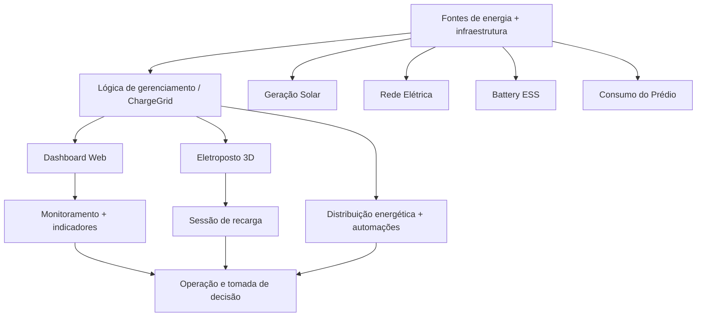
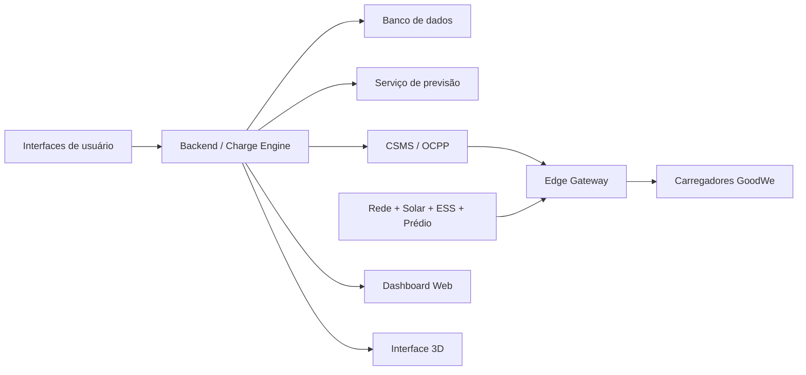

# GoodWe ChargeGrid Intelligence

> **FIAP Challenge 2026 — Sprint 3 | Fase 2: Documentação e GitHub**  
> Protótipo de gerenciamento inteligente de recarga de veículos elétricos para ambientes comerciais.

## 1. Equipe

| Integrante | RM |
|---|---:|
| Gabriel Barbosa Furin | 572941 |
| Gabriel de Almeida Santos | 569395 |
| Herbert Soares de Jesus | 571507 |
| Lucas Kiodi Moraca | 571004 |
| Renan Fracalossi Mano da Silva | 569610 |

---

## 2. Visão geral

O **GoodWe ChargeGrid Intelligence** é uma solução proposta para transformar a recarga de veículos elétricos em ambientes comerciais em uma operação mais inteligente, coordenada e eficiente energeticamente.

A solução é apresentada na Sprint 3 por meio de **duas interfaces complementares do mesmo produto**:

- **Dashboard Web:** gestão, monitoramento e visualização dos dados da operação.
- **Eletroposto 3D:** demonstração visual e funcional/simulada da operação física do eletroposto e de uma sessão de recarga.

As duas interfaces possuem funções diferentes, mas representam partes complementares da mesma solução.

### Dashboard Web

O Dashboard permite acompanhar estações, sessões, demanda elétrica, distribuição de potência, indicadores operacionais, logs simulados e cenários de simulação.

**Acesso:**  
https://goodwe-grid-smart.lovable.app/

### Eletroposto 3D

O protótipo 3D representa o eletroposto, as fontes de energia, o armazenamento, o consumo do prédio e os veículos envolvidos na recarga.

Arquivos principais:

- `index_V8_1_SPRINT3.html`
- `ChargeGrid_Web.glb`

---

## 3. Problema

Em um ambiente comercial, vários veículos podem ser conectados simultaneamente aos carregadores. A soma da demanda dos carregadores com o consumo normal do empreendimento pode aproximar ou ultrapassar a capacidade disponível da instalação.

O ChargeGrid propõe uma camada de gerenciamento capaz de acompanhar a demanda e distribuir a potência disponível de maneira coordenada.

A proposta considera:

- demanda da rede;
- consumo do prédio;
- geração solar;
- Battery ESS;
- potência dos veículos;
- prioridade de carregamento;
- redução de picos;
- acompanhamento da sessão;
- indicadores para o operador.

---

## 4. Objetivo

Demonstrar um protótipo integrado conceitualmente capaz de representar:

1. gerenciamento de estações de recarga;
2. monitoramento de demanda;
3. sessão de recarga;
4. distribuição dinâmica de potência;
5. geração solar;
6. armazenamento por Battery ESS;
7. acompanhamento de veículos;
8. estratégias de carregamento;
9. Peak Shaving;
10. visualização de métricas e resultados.

---

# 5. Arquitetura da solução

A arquitetura conceitual do ChargeGrid conecta as fontes de energia e cargas à lógica de gerenciamento, que é apresentada pelas duas interfaces.



O detalhamento da arquitetura está disponível em [`docs/ARQUITETURA.md`](docs/ARQUITETURA.md).

---

# 6. Dashboard Web

O Dashboard Web foi desenvolvido como uma aplicação web baseada em React/TypeScript e disponibilizada pelo Lovable.

## Funcionalidades

### Painel Geral

Apresenta uma visão geral da operação utilizando dados simulados.

### Balanceamento

Apresenta a potência distribuída e a capacidade da rede. O protótipo calcula a potência dos carregadores e utiliza um limite de rede simulado para demonstrar o gerenciamento da demanda.

### Estações

Apresenta informações dos carregadores simulados, incluindo:

- identificação;
- nome;
- tipo;
- potência máxima;
- potência atual;
- status;
- usuário;
- veículo;
- percentual de carga;
- tempo estimado;
- tarifa;
- modo de recarga;
- energia da sessão.

### Logs OCPP

A interface apresenta eventos com nomenclatura inspirada em OCPP, como:

- `BootNotification`;
- `Heartbeat`;
- `StartTransaction`;
- `StopTransaction`;
- `StatusNotification`;
- `MeterValues`;
- `Authorize`;
- eventos de Load Balancing.

**Importante:** os eventos são gerados localmente pelo protótipo. Não representam uma integração OCPP real com carregador físico ou CSMS externo nesta Sprint.

### IA & Previsão

A interface apresenta gráficos, indicadores e insights de previsão.

Nesta versão, os dados e cálculos são simulados localmente. Não há um modelo de Machine Learning treinado e validado conectado ao Dashboard.

**Classificação:** demonstração/simulação.

### Simulador "E Se...?"

Permite alterar parâmetros como:

- número de carregadores;
- consumo base do prédio;
- limite contratado;
- veículos simultâneos;
- geração solar.

Os cenários apresentam resultados estimados de demanda, redução de pico, economia e retorno do investimento.

Os valores são resultados de simulação matemática, não medições reais de campo.

### Faturamento

Apresenta informações de faturamento e receita utilizando dados simulados.

**Pagamento financeiro real não está implementado.**

### Usuários & Frotas

Apresenta informações de usuários e frotas dentro do escopo visual do protótipo.

Integrações externas de identidade, frota e banco de dados persistente não estão implementadas nesta Sprint.

---

# 7. Eletroposto 3D

O Eletroposto 3D demonstra a operação física/simulada de uma estação de recarga.

O ambiente utiliza o modelo `ChargeGrid_Web.glb`, carregado pelo `index_V8_1_SPRINT3.html`.

## 7.1 Fluxo da sessão

```text
Identificação
      ↓
Configuração
      ↓
Pagamento
      ↓
Liberação da trava
      ↓
Retirada do conector
      ↓
Conexão ao EV 03
      ↓
Carregamento
      ↓
Distribuição energética
      ↓
Encerramento
      ↓
Devolução
      ↓
Travamento
```

## 7.2 Elementos representados

O protótipo demonstra:

- geração solar;
- rede elétrica;
- Battery ESS;
- consumo do prédio;
- EV 01;
- EV 02;
- EV 03;
- distribuição automática de potência;
- tempo da sessão;
- energia entregue;
- custo;
- percentual de energia renovável.

---

# 8. Distribuição energética

O conceito central do ChargeGrid é utilizar a energia disponível de forma coordenada.

```text
              Geração Solar
                    │
                    ▼
Rede Elétrica ──► ChargeGrid ◄── Battery ESS
                    │
           ┌────────┼────────┐
           ▼        ▼        ▼
        EV 01    EV 02    EV 03
                    │
                    ▼
             Consumo do prédio
```

A lógica simulada considera o cenário energético representado no protótipo para distribuir a potência entre os veículos.

O objetivo é evitar que a demanda simulada ultrapasse o limite estabelecido e demonstrar como a potência pode ser redistribuída conforme as condições da operação.

---

# 9. Dados técnicos do Eletroposto 3D

Os valores abaixo pertencem especificamente à simulação do protótipo 3D.

| Parâmetro | Valor |
|---|---:|
| Limite da rede | **35 kW** |
| Consumo base do prédio | **32 kW** |
| Battery ESS | **60 kWh** |
| SOC inicial | **72%** |
| EV 01 | até **18 kW** |
| EV 02 | até **12 kW** |
| EV 03 — Econômico | até **20 kW** |
| EV 03 — Rápido | até **28 kW** |
| Fator da simulação | **60×** |

### Valores do Dashboard

O Dashboard possui uma simulação independente:

- limite de rede: **200 kW**;
- consumo base: **120 kW**;
- carregadores com potência máxima de até **22 kW**.

Os cenários do Dashboard e do Eletroposto 3D não devem ser tratados como os mesmos parâmetros físicos.

---

# 10. Estratégias de recarga

O Dashboard trabalha com diferentes modos simulados:

| Modo | Objetivo |
|---|---|
| Rápido | Priorizar potência de recarga |
| Econômico | Utilizar menor potência em períodos de menor demanda |
| Sustentável | Priorizar energia solar disponível |
| Garantido | Buscar atingir o percentual definido no horário informado |

---

# 11. Peak Shaving

O protótipo apresenta uma demonstração de Peak Shaving.

```text
Demanda elevada
      ↓
Detecção do cenário
      ↓
Peak Shaving
      ↓
Redução temporária de potência
      ↓
Menor demanda dos EVs
      ↓
Operação dentro do limite
```

No Dashboard, a ação reduz temporariamente a potência de carregadores em modo econômico e registra o evento nos logs simulados.

**Status:** implementado como simulação.

---

# 12. Dados e atualização

O Dashboard utiliza uma camada local de dados simulados (`LiveDataProvider`).

O estado contempla:

- carregadores;
- sessões ativas;
- sessões concluídas;
- logs;
- série temporal de carga;
- potência distribuída;
- kWh;
- receita;
- estado do Peak Shaving.

A atualização ocorre aproximadamente a cada **2 segundos**, permitindo demonstrar uma operação dinâmica sem depender de hardware físico durante a apresentação.

---

# 13. Tecnologias

## Dashboard Web

- React 18
- TypeScript
- Vite
- Tailwind CSS
- shadcn/ui
- Radix UI
- React Router
- Recharts
- Leaflet
- OpenStreetMap
- Lucide React
- TanStack React Query
- Vitest

## Eletroposto 3D

- HTML
- CSS
- JavaScript
- Three.js
- GLTFLoader
- PointerLockControls
- GLB

---

# 14. Status das funcionalidades

| Funcionalidade | Status |
|---|---|
| Dashboard Web | **Implementado** |
| Eletroposto 3D | **Implementado** |
| Sessão de recarga simulada | **Implementado** |
| Distribuição energética | **Implementado como simulação** |
| Geração solar | **Implementado na simulação 3D** |
| Battery ESS | **Implementado na simulação 3D** |
| Load Balancing | **Implementado como simulação** |
| Peak Shaving | **Implementado como simulação** |
| Logs OCPP | **Simulados** |
| IA/Previsão | **Demonstração simulada** |
| Pagamento real | **Planejado** |
| PIX real | **Planejado** |
| Cartão real | **Planejado** |
| OCPP real | **Planejado** |
| CSMS real | **Planejado** |
| Banco de dados persistente | **Planejado** |
| Raspberry Pi / Edge Gateway físico | **Planejado** |
| Integração física com carregador GoodWe | **Planejado / depende de validação do hardware** |
| Modelo de Machine Learning treinado | **Planejado** |

---

# 15. Arquitetura futura

Uma evolução para produção pode substituir as simulações locais por serviços reais:



Essa arquitetura permitiria receber telemetria real, persistir sessões, controlar dispositivos autorizados e utilizar dados históricos para previsão.

---

# 16. Segurança

A versão atual é um protótipo e não deve ser considerada uma arquitetura de produção.

Para uma implementação real, deverão ser considerados:

- autenticação;
- autorização por perfil;
- TLS;
- autenticação de dispositivos;
- rotação de credenciais;
- validação de mensagens;
- isolamento da rede dos carregadores;
- logs de auditoria;
- monitoramento do Edge Gateway;
- proteção da API;
- armazenamento seguro de informações de pagamento.

---

# 17. Execução

## Eletroposto 3D

Coloque `index_V8_1_SPRINT3.html` e `ChargeGrid_Web.glb` na mesma pasta.

Execute um servidor HTTP local:

```bash
python -m http.server 8000
```

Depois acesse:

```text
http://localhost:8000/index_V8_1_SPRINT3.html
```

O servidor HTTP local evita problemas de carregamento de recursos do modelo 3D.

## Dashboard Web

O Dashboard está publicado em:

https://goodwe-grid-smart.lovable.app/

O código-fonte do Dashboard permanece associado ao projeto de origem no Lovable. Portanto, este repositório não declara possuir uma cópia do código-fonte do Dashboard caso ela não esteja sendo versionada aqui.

---

# 18. Estrutura do repositório

```text
Sprint-3-Python/
│
├── README.md
├── index_V8_1_SPRINT3.html
├── ChargeGrid_Web.glb
│
├── docs/
│   ├── ARQUITETURA.md
│   └── VALIDACAO.md
│
└── imagens/
    ├── dashboard/
    └── eletroposto-3d/
```

As imagens devem ser utilizadas como evidências da Fase 1 e podem ser organizadas por interface.

---

# 19. Evidências

## Dashboard Web

Recomenda-se registrar:

1. tela principal;
2. métricas e gráficos;
3. estações;
4. balanceamento;
5. Peak Shaving;
6. simulador;
7. logs;
8. insights/previsão.

## Eletroposto 3D

Recomenda-se registrar:

1. visão geral;
2. identificação/configuração;
3. pagamento;
4. liberação da trava;
5. retirada do conector;
6. conexão ao EV 03;
7. carregamento;
8. Energy Engine;
9. distribuição entre EV 01/02/03;
10. resumo da sessão.

Não é necessário anexar dezenas de imagens. O objetivo é comprovar as principais funções da Sprint.

---

# 20. Sustentabilidade e eficiência energética

A contribuição do ChargeGrid está principalmente na utilização mais eficiente da infraestrutura elétrica disponível.

O protótipo demonstra:

- gerenciamento de picos;
- distribuição de potência;
- aproveitamento de geração solar;
- utilização de armazenamento;
- priorização de carregamentos;
- acompanhamento do consumo;
- coordenação entre diferentes cargas.

A proposta busca evitar a necessidade de tratar cada carregador de forma isolada, permitindo que a infraestrutura disponível seja administrada de maneira coordenada.

---

# 21. Limitações do protótipo

A Sprint 3 apresenta um MVP/protótipo. Portanto:

- os dados do Dashboard são simulados localmente;
- os dados do Eletroposto 3D são simulados;
- não há conexão comprovada com um carregador GoodWe físico;
- não há Edge Gateway/Raspberry Pi conectado nesta versão;
- não há CSMS real;
- os eventos OCPP são simulados;
- não há pagamento financeiro real;
- PIX e cartão não processam transações reais;
- a previsão de IA é uma demonstração baseada em dados/cálculos simulados;
- não há modelo de Machine Learning treinado e validado;
- os valores de ROI são estimativas de simulação;
- não há banco de dados persistente para os dados simulados.

Essas limitações fazem parte do escopo do protótipo e devem ser consideradas na avaliação.

---

# 22. Próximos passos

Uma versão posterior pode incluir:

1. backend e API;
2. banco de dados;
3. Edge Gateway em Raspberry Pi;
4. comunicação real com carregadores;
5. OCPP/CSMS real, caso aplicável;
6. autenticação e autorização;
7. pagamentos reais;
8. modelo de previsão treinado com dados históricos;
9. observabilidade e monitoramento;
10. integração com sistemas prediais;
11. testes em ambiente físico;
12. validação energética com dados reais.

---

## 23. Links

- **Dashboard Web:** https://goodwe-grid-smart.lovable.app/
- **Protótipo 3D:** `index_V8_1_SPRINT3.html`
- **Modelo 3D:** `ChargeGrid_Web.glb`
- **Arquitetura:** [`docs/ARQUITETURA.md`](docs/ARQUITETURA.md)
- **Validação:** [`docs/VALIDACAO.md`](docs/VALIDACAO.md)

---

## 24. Documentação complementar

Para informações técnicas detalhadas, consulte:

- [`ARQUITETURA.md`](docs/ARQUITETURA.md)
- [`VALIDACAO.md`](docs/VALIDACAO.md)
